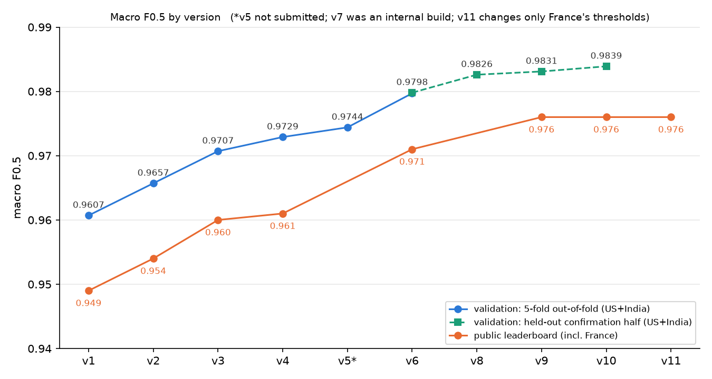

# Business Entity Resolution — Amazon ML Challenge 2026

A pipeline for matching business records across three noisy sources (names and addresses in the US, India and France), built for the Amazon ML Challenge 2026 (72-hour hackathon, team **LowkeyLegends**).

## Task

- Three sources of business records: `entity_id`, `business_name`, `business_address`, `country`. Source 1 (S1) has no duplicates; Sources 2 and 3 contain noisy copies of S1 businesses, plus records that match nothing.
- For every S1 entity, output the list of matching S2/S3 records (possibly none).
- Metric: macro-averaged F0.5 per S1 entity. An entity with no true match scores 1 only if its predicted list is empty.
- Scale: 1.73M test S1 entities against 10.0M S2/S3 records. The test set includes **France**, which does not appear in training data.
- Also submitted: the candidate set the matcher scored (`candidate_pairs.tsv`); smaller sets rank higher.
- Rules: no external data or APIs; models must be MIT/Apache-2.0 and at most 8B parameters.

## Results

| Version | Main change | Validation macro F0.5 | Public leaderboard |
|---|---|---|---|
| v1 | Blocking + LightGBM cascade (50k training entities) | 0.9607 | 0.949 |
| v2 | Mined spelling variants, French rules, candidate filter | 0.9657 | 0.954 |
| v3 | Top-20 blocking, context rules, distinctive-name and house-number features | 0.9707 | 0.960 |
| v4 | Reverse-competition features | 0.9729 | 0.961 |
| v6 | 400k training entities, graph stage, XLM-R cross-encoder | 0.9797 | 0.971 |
| v9 | Reverse-retrieval candidates, retrained cascade, XLM-R + mDeBERTa cross-encoders | 0.9831* | 0.976 |
| v10 | LightGBM combiner over cross-encoder scores and pair evidence | 0.9839* | 0.976 |
| v11 | v10 with stricter decision thresholds for France only | not measurable (no French labels) | 0.976 (marginally higher at the 4th decimal) |

\* Held-out confirmation half of the cross-encoder-covered training entities; the frozen v6 model scores 0.9798 on the same entities. v10 − v9 = +0.0008, 95% paired-bootstrap CI [+0.0006, +0.0009]. Validation covers US and India only; the leaderboard also includes France.



The public leaderboard was the only external measurement during the event; final rankings on the private leaderboard were not available when this was written.

## Approach

```
normalise ──► blocking ──► stage-1 filter ──► stage-2 matcher ──► graph stage ──► cross-encoders ──► combiner ──► decode
```

1. **Normalisation** — Unicode NFKC and transliteration of Indic scripts, legal-form extraction (US, India, France), abbreviation tables, context rules (`St Joseph` → saint vs `Nethaji St` → street), French address rules, 512 variant spellings mined from training pairs, consonant-skeleton and loose-phonetic keys.
2. **Blocking** — three hashed, streamed TF-IDF retrievers per country (name+address, consonant skeleton, address-only), top-20 per source, plus a **reverse retriever** (each S2/S3 record's five nearest S1 entities over the whole S1 universe). About 82 raw candidates per S1 entity, 98.2% pair recall.
3. **Stage-1 LightGBM filter** — cheap features; keeps p ≥ 0.01 and top 10 per entity (about 5.6 candidates per entity).
4. **Stage-2 LightGBM** — about 80 features: name similarity and a distinctive-name view (noise words learned from true pairs), loose phonetic key, address and house-number digit features, name frequency, and reverse-competition features.
5. **Graph stage** — a sibling index over S2 ∪ S3; confident matches vouch for or pull in their near-duplicates (2-hop expansion, graph-support features).
6. **Cross-encoders** (Kaggle, T4 × 2) — Ditto-style serialisation (`[COL] name [VAL] … [COL] address [VAL] …`) with XLM-RoBERTa-base and mDeBERTa-v3-base, trained on uncertain pairs with entity-level 2-fold cross-fitting, span/attribute augmentation and pseudo-labelled French pairs.
7. **Combiner** — logistic regression (v9) or a small LightGBM that also sees cross-encoder disagreement and pair evidence (v10).
8. **Decoding** — one owner per S2/S3 record, first-match threshold, extra-match threshold and relative threshold, tuned on the exact macro F0.5.

Uncertain-pair AUC on held-out data: mDeBERTa 0.963, XLM-R 0.959, graph-stage LightGBM 0.951.

## What did not help (measured)

LightGBM + XGBoost ensemble (+0.0004); collective similarity features (+0.0008); removing absolute retrieval features for country robustness (worse); self-training on an unseen-country simulation (+0.0007); an eligibility-aware reassignment decoder (±0); a GBM stacker on logits only (+0.0001); running the cross-encoder on very low-probability pairs (0.17% of true pairs); matching predicted match counts across countries to calibrate France (wrong direction in both simulations). Details in [docs/EXPERIMENT_LOG.md](docs/EXPERIMENT_LOG.md).

## Known limitations

- **France is unvalidated.** No French labels exist. A simulation (train on one country, evaluate on the other) gave macro F0.5 0.878 for US → India versus 0.948 in-domain, so the France score is likely lower than the US/India validation.
- About 44% of the remaining validation loss is true matches that never enter the candidate set (mostly renamed businesses, native-script names and empty addresses). See [docs/figures/remaining_loss.png](docs/figures/remaining_loss.png).
- The final France setting (v11) was chosen on the public leaderboard, not on validation data.

## Repository layout

```
code/business_entity_resolution/
  src/ber/     normalisation, blocking, features, reverse and graph stages, decoding, metrics
  scripts/     pipeline entry point (make_submission.py), cross-encoder export and gating, combiner, experiments
  kaggle/      GPU cross-encoder training scripts (XLM-R, mDeBERTa)
  tests/       unit tests (scorer, normaliser)
  README.md    exact run commands and source map
docs/
  METHODOLOGY.md    write-up submitted with the solution
  EXPERIMENT_LOG.md every version, negative results, error analysis, engineering notes
  figures/          plots used in the write-up
```

## Reproducing

Data is not included: place the organisers' files at `student_resource/dataset/{train,test}/` (or set `BER_DATA_DIR`). See [code/business_entity_resolution/README.md](code/business_entity_resolution/README.md) for the full command sequence. Requirements: Python 3.11 and 16 GB RAM (every stage streams in chunks); a full rebuild takes roughly 10 CPU-hours plus about 5 GPU-hours on Kaggle for the cross-encoders.

```bash
cd code/business_entity_resolution
python3.11 -m venv .venv && .venv/bin/pip install -r requirements.txt
PYTHONPATH=src .venv/bin/python -m pytest
```

## Models and data

LightGBM (MIT), XLM-RoBERTa-base (MIT, 278M parameters), mDeBERTa-v3-base (MIT, 276M) and multilingual MiniLM (Apache-2.0, 118M, used in experiments). No external data or APIs were used. The competition dataset belongs to the organisers and is not redistributed.
