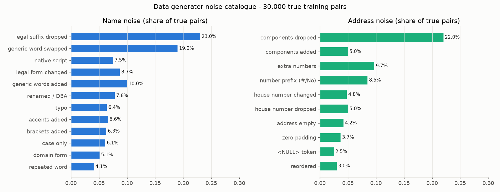
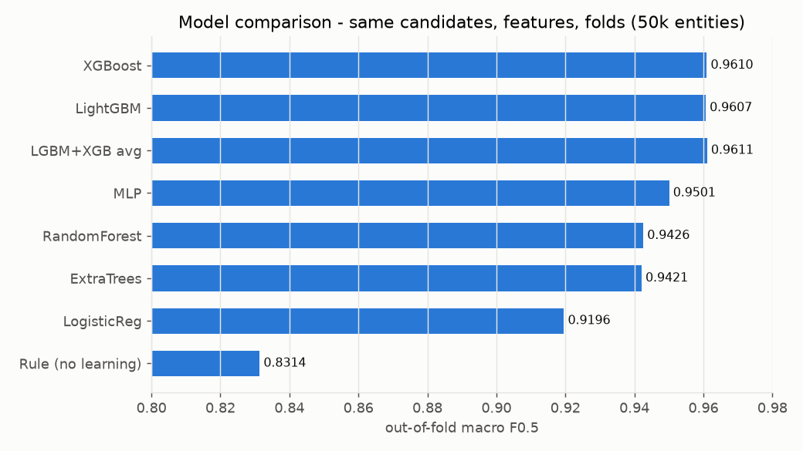
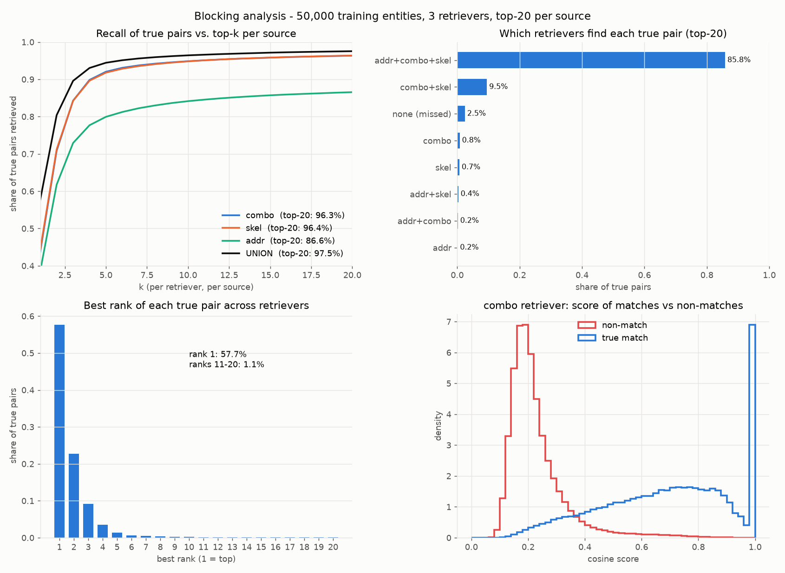
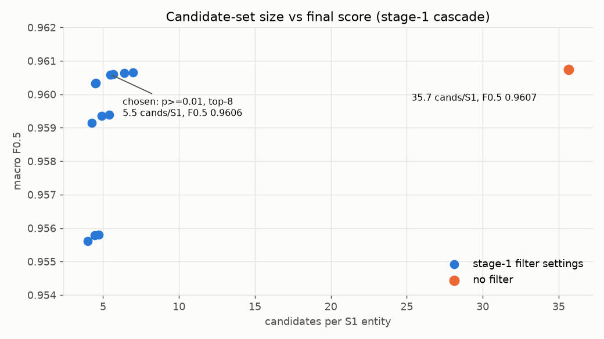
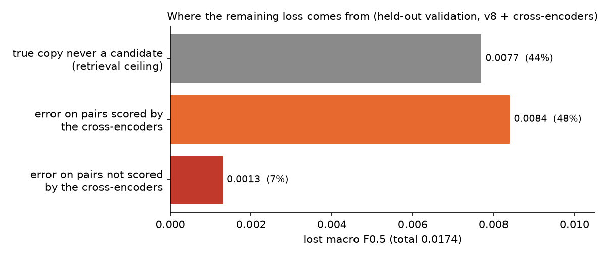
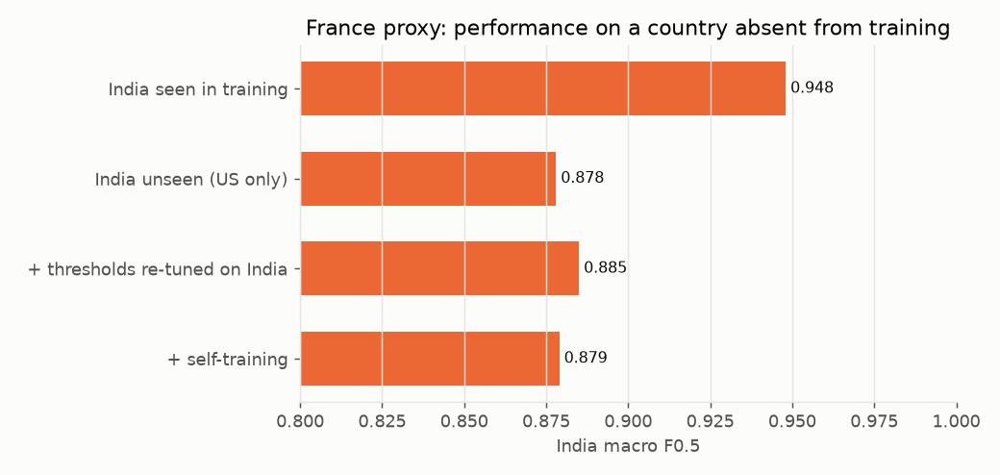

# Experiment log

All numbers are macro F0.5 unless stated. "Validation" is US + India only; France has no labels.
Two validation protocols were used: 5-fold out-of-fold on a training sample (v1–v6), and a held-out
*confirmation* half of the cross-encoder-covered entities, where the combiner and thresholds are fitted on the
other half and a paired bootstrap by entity is run against the last submitted version (v8 onwards).

## 1. Data findings that shaped the design

- Train: 2.21M S1 (US 1.32M, India 0.88M), 10.3M S2+S3. Test: 1.73M S1 (India 0.81M, US 0.66M, France 0.26M), 10.0M S2+S3.
- 5.6% of S1 entities have no match, and the rate is the same in US and India; mean 3.46 matches (max 11).
- Each S2/S3 record matches at most one S1 entity; matches never cross countries; 26% of S2/S3 records match nothing; 30% of S1 names are exact duplicates. Row order and ID numbers carry no signal.
- Noise (share of true pairs): legal suffix dropped 23%, generic word swapped 19%, native Indic script 7.5% (India 18%), legal form changed 9%, generic words added 10%, renamed/DBA 8%, typos 6%, accents 7%. Address: components dropped 22% (India 43%), extra numbers 10%, number prefixes 9%, house number changed 5%, number dropped 5%, empty 4%.
- Decoys: of confident false merges, 32–49% belong to another S1 entity and the rest match nothing (same name without address, a different business at the same address, same name at another house number).

## 2. Versions

| Version | Change | Validation | Leaderboard |
|---|---|---|---|
| v1 | 3 retrievers → LightGBM cascade, 50k training entities | 0.9607 | 0.949 |
| v2 | 512 spelling variants mined from true pairs, French normalisation rules, candidate filter, 200k entities | 0.9657 | 0.954 |
| v3 | Top-20 retrieval, context rules (saint/street, doctor/drive), distinctive-name and house-number digit features | 0.9707 | 0.960 |
| v4 | Reverse-competition features (does this record fit another S1 entity better?) | 0.9729 | 0.961 |
| v5 | Sibling graph over S2 ∪ S3 (not submitted) | 0.9744 | — |
| v6 | 400k entities + graph stage + XLM-R cross-encoder on uncertain pairs | 0.9797 | 0.971 |
| v8 | Reverse retriever as a 4th candidate source, cascade retrained, cross-encoder retrained with a wider score band (not submitted) | 0.9826* | — |
| v9 | v8 + mDeBERTa-v3-base cross-encoder; logistic combiner | 0.9831* | 0.976 |
| v10 | LightGBM combiner over cross-encoder scores, their disagreement and pair evidence | 0.9839* | 0.976 |
| v11 | v10 with a France-only logit offset of +0.75 on the decision probability (stricter) | — | 0.976 (marginally higher at the 4th decimal) |

\* Held-out confirmation half; frozen v6 scores 0.9798 there. v9 − v6 = +0.0033 (95% CI [+0.0030, +0.0036]; US +0.0026, India +0.0043, singletons +0.0060). v9 − v8 = +0.0005 [+0.0004, +0.0007]. v10 − v9 = +0.0008 [+0.0006, +0.0009].

Model comparison at 50k training entities under identical folds: XGBoost 0.9610, LightGBM 0.9607, MLP 0.9501, random forest 0.9426, extra trees 0.9421, logistic regression 0.9196, rule-based baseline 0.8314.

## 3. Blocking

Retrievers (top-20 per source, per country): name+address words and bigrams (recall 96.3%), consonant skeleton (96.4%), address only (86.6%); union 97.6%. Each contributes pairs the others miss. The reverse retriever added 0.6 points (97.57% → 98.16%), raising the candidate-set oracle F0.5 from 0.9914 to 0.9936. The stage-1 filter reduced candidates from about 74 to 5.5 per entity at unchanged F0.5.

## 4. Cross-encoders

- Ditto-style serialisation, number and legal-form tagging, augmentation (span deletion, span shuffle, attribute deletion, swap).
- Trained only on pairs the tabular model is unsure about (0.01 < p < 0.99), plus a 7% sample of confident pairs and 60k French pseudo-labelled pairs per fold; 2-fold cross-fitting by S1 entity so the combiner sees honest scores.
- Uncertain-pair AUC: mDeBERTa 0.9629, XLM-R 0.9590, graph-stage LightGBM 0.9508.
- fp16 mixed precision with fp32 master weights (`model.float()` after loading, otherwise "Attempting to unscale FP16 gradients"); per-fold checkpoints and sharded resumable test inference because Kaggle sessions disconnect.
- 1.3% of pairs (India only) exceed the 128-token limit; a truncation audit showed no change in score.

## 5. Remaining loss (v8 + cross-encoders, held-out sample, loss 0.0174)

- True copy never a candidate: 0.0077 (44%). Of the 1.85% of true pairs still missing after forward and reverse retrieval: 35% share a house number and street word but the business was renamed; 23% have an equal loose-phonetic name (native-script names); 27% have an empty address.
- Errors on cross-encoder-scored pairs: 0.0084 (48%).
- Errors on pairs the cross-encoders did not score: 0.0013 (8%). Running a cross-encoder on every pair would cost roughly 3–4.5 GPU-hours for at most that gain, so it was not done.

## 6. France (unseen country)

Simulation on training data: train on one country, evaluate on the other.

- US → India: 0.878 unseen vs 0.948 in-domain; re-tuning thresholds on the target country 0.885; self-training 0.879 (+0.0007 at best).
- Shifting the target country's probabilities so its predicted no-match rate equals the source country's (a label-free calibration idea) moved the score the wrong way in both directions: US → India 0.8922 vs 0.8996 unshifted; India → US 0.9611 vs 0.9663. The best offsets pointed in opposite directions (+0.75 for US → India, −0.75 for India → US) with gains of only 0.001–0.002.
- The v10 output leaves 5.0% of French S1 entities with an empty list, while the true rate is 5.6% in both training countries, which suggests some French no-match entities receive false matches. v11 therefore applies a stricter France-only threshold. Its effect on the leaderboard was within the third decimal, so it is best treated as a small, unvalidated adjustment.

## 7. Tried and rejected

| Idea | Result |
|---|---|
| LightGBM + XGBoost ensemble | +0.0004 |
| Collective similarity features | +0.0008 |
| Dropping absolute retrieval features for country robustness | worse |
| Self-training on the unseen country (simulation) | +0.0007 |
| Eligibility-aware reassignment decoder | ±0.0000 |
| GBM stacker on cross-encoder logits only | +0.0001 (with pair evidence: +0.0008, v10) |
| Cross-encoder on pairs with p ≤ 0.02 | covers 0.17% of true pairs |
| MiniLM added on top of XLM-R | no gain |
| Cross-encoder scored on all pairs | not run; upper bound +0.0013 |

## 8. Engineering notes (16 GB MacBook + Kaggle T4 × 2)

- Every script that spawns processes needs an `if __name__ == "__main__":` guard (macOS uses spawn).
- LightGBM and `sparse_dot_topn` in the same process deadlocked (OpenMP); each pipeline stage runs as its own subprocess.
- A character n-gram retriever needed about 33 GB of RAM; replacing it with streamed `HashingVectorizer` features, a document-frequency cap and bigram tokens was 26× faster and improved recall.
- Test scoring is chunked (100k S1 entities per file) and resumable, with provenance guards so files from different runs cannot be mixed. A mixed run (out-of-fold scores from one Kaggle session and test scores from another) was caught and re-downloaded.
- Long runs stall if the laptop sleeps; `caffeinate -i` and an open lid were required. Keep at least 10 GB of disk free (swap needs it).
- Kaggle: one interactive GPU session per account, sessions disconnect when the tab is idle, so committed ("Save & Run All") runs were used for the long jobs.
